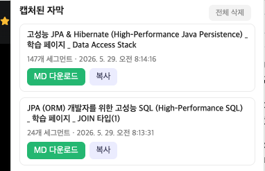

# Inflearn 자막 → Markdown 크롬 확장

인프런 강의 페이지에서 **스크립트(자막) 패널을 열 때 발생하는 자막 요청**(`/encrypted/subtitles/json`)을 가로채, 강사가 말한 내용을 **학습용 Markdown 파일**로 저장하는 크롬 확장입니다. 1차 요약 작업의 입력으로 그대로 쓸 수 있습니다.

## 동작 방식

```
[강의 페이지에서 스크립트 패널 열기]
        │  (페이지가 subtitles/json 요청)
        ▼
background.js (webRequest.onCompleted)   ← 자막 요청 URL 감지 (타이밍·프레임 무관)
        │  같은 서명 URL 을 서비스워커가 한 번 더 fetch
        ▼
JSON 파싱 → Markdown 변환 → chrome.storage 저장
        │  chrome.tabs.sendMessage
        ▼
content.js   ← 화면 우하단 다운로드 버튼 표시
        │  버튼 클릭 → chrome.runtime.sendMessage
        ▼
background.js   ← chrome.downloads 로 .md 저장
```

- 페이지의 `fetch`/`XHR` 를 가로채는 대신 **`webRequest` 로 요청 URL 만 감지**하고, 그 서명 URL 을 서비스워커가 다시 받아 본문을 읽습니다. 페이지 로드 시점에 자막이 먼저 떨어져도(예: URL 에 `tab=script` 포함) 놓치지 않습니다.
- CloudFront 서명 URL 은 만료(`DateLessThan`) 전까지 재사용 가능하고, 정책에 IP 제한이 없어 같은 PC 에서 재요청이 정상 동작합니다.
- 응답 형태: `[{"start":786,"end":5265,"text":"...","speaker":0}, ...]` (start/end 는 ms).

> 설치 시 "**브라우저 기록 읽기**" 권한 경고가 뜨는데, 이는 `webRequest` 로 인플런 자막 요청을 감지하기 위한 것입니다(`host_permissions` 가 `*.inflearn.com` 으로 한정되어 인플런 외 사이트는 관여하지 않습니다).

## 설치 (개발자 모드 / 압축 해제된 확장)

1. 크롬 주소창에 `chrome://extensions` 입력
2. 우측 상단 **개발자 모드** 토글 ON
3. **압축해제된 확장 프로그램을 로드합니다** 클릭
4. 이 폴더(`~/tools/inflearn-subtitle-extractor`) 선택

## 사용법

1. 인프런 강의 재생 페이지로 이동
2. 우측 **스크립트(자막)** 버튼 클릭 → 자막 패널 표시
3. 화면 우하단에 **`📄 자막 MD 다운로드`** 버튼이 나타남 → 클릭하면 `.md` 저장
4. 또는 툴바의 확장 아이콘(팝업)에서 캡처 목록 확인 → **MD 다운로드** / **복사**(클립보드)

### 사용 예시

강의 페이지에서 스크립트 패널을 열면 자막이 자동 캡처되고, 확장 팝업에서 `강의명 _ 학습 페이지 _ 강의 단위 제목` 형식의 제목과 세그먼트 수, **MD 다운로드** / **복사** 버튼이 나타납니다.



### 1차 요약으로 이어가기

- 팝업의 **복사** 버튼으로 트랜스크립트를 클립보드에 담은 뒤 Claude 에 붙여넣어 요약을 요청하거나,
- 저장된 `.md` 파일을 그대로 넘기면 됩니다.

## 산출물 저장 위치 (중요한 제약)

크롬 확장은 보안상 **다운로드 폴더 밖으로 파일을 쓸 수 없습니다.** 따라서 파일은
`~/Downloads/inflearn-subtitles/<강의명>.md` 에 저장됩니다.

이 도구 폴더(`~/tools/inflearn-subtitle-extractor/outputs/`)에 모으고 싶다면 둘 중 하나:

```bash
# (1) 수동/주기적 이동
mv ~/Downloads/inflearn-subtitles/*.md ~/tools/inflearn-subtitle-extractor/outputs/

# (2) 심볼릭 링크로 한 폴더처럼 사용
ln -s ~/Downloads/inflearn-subtitles ~/tools/inflearn-subtitle-extractor/outputs/_downloads
```

## 생성되는 Markdown 예시

제목은 `{강의명} _ 학습 페이지 _ {강의 단위 제목}` 형식입니다. 강의 단위 제목은 캡처 시점에 탭 URL 의 `unitId` 로 인플런 units API(`ucc-api.inflearn.com/.../units/{id}`, 인증 불필요)를 조회해 가져옵니다.

```markdown
# JPA (ORM) 개발자를 위한 고성능 SQL (High-Performance SQL) _ 학습 페이지 _ JOIN 타입(1)

- 캡처 일시: 2026-05-29T...
- 영상 ID: d4e57318-07d5-4140-ab68-fd6437df3cef
- 세그먼트 수: 42

> 개인 학습용 자막 추출. 외부 재배포 금지.

---

[00:00] 고성능 Java Persistence 교육의 새로운 에피소드에 오신 것을 환영합니다.
[00:05] 이번 에피소드에서는 통합 테스트에 대해 다루겠습니다.
...
```

## 트러블슈팅

- **버튼이 안 뜬다 / 팝업이 비어있다**: 자막 요청이 발생해야 잡힙니다. 강의 페이지를 **새로고침**하거나 스크립트 패널을 닫았다 다시 여세요.
- **로그 확인**: `chrome://extensions` → 이 확장의 **서비스 워커**(`background.js`) 링크 클릭 → 콘솔에서 `[inflearn-sub]` 로그 확인.
  - `자막 요청 감지` 가 안 보이면 → 요청 자체를 못 본 것. 자막 호스트가 `*.inflearn.com` 이 아닐 수 있으니 실제 요청 도메인을 확인 후 `manifest.json` 의 `host_permissions` 와 webRequest 필터에 추가.
  - `자막 요청 감지` 는 보이는데 `캡처 완료` 가 없으면 → 서명 URL 재요청 실패(만료/403). 패널을 다시 열어 새 서명으로 시도.
- **변경 후 반영 안 됨**: `chrome://extensions` 에서 이 확장의 새로고침(↻) 버튼을 누른 뒤 강의 페이지도 새로고침.

## 주의

- 본인이 구매·수강 중인 강의의 **개인 학습 노트** 용도로만 사용하세요. 외부 재배포 금지.
- HAR 파일과 서명 URL(`Policy`/`Signature`)은 세션 토큰이 포함된 민감정보입니다. 공유/커밋하지 마세요.
